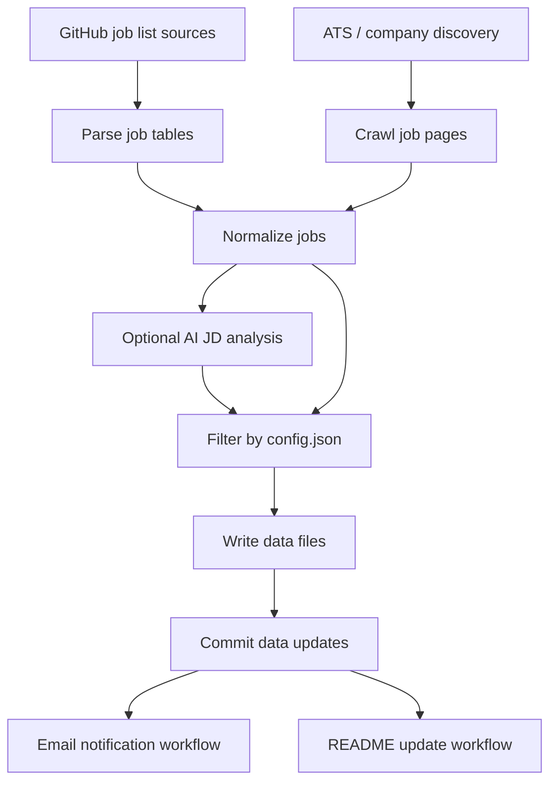

# Installation Guide

This guide explains how to set up **JobRadar-AI** from the template repository, configure it with the GitHub issue form, add required secrets, verify the setup, and understand how the scheduled workflows run.

JobRadar-AI is designed as a **self-hosted GitHub Actions workflow**. Your copy of the repository runs in your own GitHub account, uses your own email sender, and calls your own AI API key when AI analysis is enabled.

---

## 0. What you are installing

At a high level, JobRadar-AI does this:



The important pieces are:

- `config.json` controls target roles, countries, keywords, AI provider/model, SMTP sender, and receiver email.
- GitHub Actions runs the sync/discovery workflows on a schedule.
- Newly discovered jobs are committed into `data/`.
- A notification workflow sends emails only for newly updated job data.
- A README update workflow regenerates the job board when config or job data changes.

---

## 1. Create your own repository from the template

1. Open the original JobRadar-AI repository.
2. Click **Use this template**.
3. Choose **Create a new repository**.
4. Name your repository.
5. Choose **Public** or **Private**.

> Public repositories are easier for GitHub Actions usage because standard GitHub-hosted runners are free for public repositories. Private repositories may use your account's included GitHub Actions minutes.

Template repositories copy files, not your personal GitHub settings or secrets. After creating your repository, you still need to add secrets and run the setup flow below.

---

## 2. Enable GitHub Actions

In your new repository:

1. Go to **Actions**.
2. If GitHub asks you to enable workflows, click **I understand my workflows, go ahead and enable them**.

---

## 3. Add the bootstrap secret: `PAT`

JobRadar-AI commits generated config and job data back to your repository. A Personal Access Token is used for those pushes.

In your repository:

1. Go to **Settings → Secrets and variables → Actions**.
2. Click **New repository secret**.
3. Add:

```text
PAT=<your GitHub Personal Access Token>
```

### PAT permissions

For a fine-grained token, use the target repository and grant at least:

- **Contents: Read and write**
- **Issues: Read and write**

If your workflows later need to trigger downstream workflows from workflow-generated commits, using a PAT is useful because commits pushed with the default `GITHUB_TOKEN` may not trigger the same downstream workflow behavior.

> Current repository note: `.github/workflows/setup-from-issue.yml` checks out the repository using `secrets.PAT`, so `PAT` should be added before opening the setup issue.

---

## 4. Open the setup issue form

Now create the setup issue:

1. Go to **Issues**.
2. Click **New issue**.
3. Choose **Setup JobRadar-AI**.
4. Fill out the form.

The setup issue form generates your `config.json`.

### What each field means

#### Internship targets

Select internship categories to track:

- `summer intern`
- `off-season intern`

#### Full-time targets

Select full-time categories to track:

- `entry level`
- `mid level`
- `senior level`

#### Countries

Select the countries or regions you want to track.

Example:

```text
USA
Canada
Remote
```

#### Eligibility filters

These filters apply to every selected country.

```json
"filter": {
  "USA": {
    "allow_citizenship_required": false,
    "allow_no_sponsorship": false
  }
}
```

Recommended for many international students targeting U.S. roles:

```text
Allow citizenship-required jobs? false
Allow jobs without sponsorship? false
```

That means:

- Exclude jobs that require citizenship.
- Exclude jobs that do not offer sponsorship.

If you want to see more jobs and filter manually later, set one or both options to `true`.

#### Keywords

Use one keyword per line.

The default list is focused on software engineering roles, including:

```text
software
backend
frontend
full-stack
platform
web
mobile
ai
cloud
infra
swe
sde
ui
ux
```

#### AI enabled

Check **Enable AI JD analysis** if you want JobRadar-AI to send crawled job descriptions to the configured AI model.

If AI is disabled:

- `AI_API_KEY` is not required.
- JD analysis will be skipped.
- Filtering may rely more on parsed job list metadata.

#### AI provider and model

Supported provider values in the setup form:

```text
google
anthropic
openai
```

Default model:

```text
gemini-2.5-flash
```

#### Email sender

For Gmail SMTP, use:

```text
SMTP host: smtp.gmail.com
SMTP port: 587
```

The sender email is the account that sends job alerts.

#### Email receiver

The receiver email is where job alerts are sent.

You can use the same email for sender and receiver, but using a separate sender account is cleaner.

---

## 5. Wait for `config.json` to be generated

After you submit the setup issue, this workflow runs:

```text
.github/workflows/setup-from-issue.yml
```

It does the following:

1. Parses the issue form body.
2. Runs:

```bash
pnpm jobctl setup get-config
```

3. Generates `config.json`.
4. Commits `config.json` to `main`.
5. Comments on the setup issue with the next steps.

If the issue does not trigger anything, check:

- GitHub Actions are enabled.
- The issue has the `setup` label, or the title starts with `Setup JobRadar-AI`.
- The `PAT` secret exists.
- The workflow run logs under **Actions → Setup from Issue**.

---

## 6. Add email and AI secrets

After `config.json` is generated, add the runtime secrets.

Go to:

```text
Settings → Secrets and variables → Actions
```

Add:

```text
SMTP_PASS=<your SMTP password or Gmail App Password>
AI_API_KEY=<your AI provider API key, only required if AI is enabled>
PAT=<your GitHub Personal Access Token>
```

### Gmail App Password

If you use Gmail, do not use your normal Gmail password.

Use a **Gmail App Password**:

1. Enable 2-Step Verification on your Google account.
2. Create an App Password.
3. Save it as the `SMTP_PASS` secret.

If SMTP validation fails with an authentication error, the most common causes are:

- 2FA is not enabled.
- You used your normal Gmail password instead of an App Password.
- The SMTP user does not match the sender account.

---

## 7. Verify setup with `/check-setup`

Return to the setup issue and comment:

```text
/check-setup
```

This triggers:

```text
.github/workflows/check-setup.yml
```

The check workflow runs:

```bash
pnpm jobctl setup check-config
```

It validates:

- `config.json`
- SMTP config
- `SMTP_PASS`
- `PAT`
- AI provider and model, if AI is enabled
- `AI_API_KEY`, if AI is enabled

If the check passes, the bot comments on the issue and closes it.

If the check fails, the bot comments with common failure reasons. Fix the issue, then comment again:

```text
/check-setup
```

---

## 8. Run the workflows manually once

After setup passes, run these workflows manually once from the **Actions** tab.

### Community Sync Pipeline

Workflow file:

```text
.github/workflows/community-sync.yml
```

Manual run:

```text
Actions → Community Sync Pipeline → Run workflow
```

This runs:

```bash
pnpm jobctl sync
```

It parses community-maintained GitHub job lists and commits new job data if anything changed.

### ATS Discovery Pipeline

Workflow file:

```text
.github/workflows/ats-discovery.yml
```

Manual run:

```text
Actions → ATS Discovery Pipeline → Run workflow
```

This runs:

```bash
pnpm jobctl scan
```

It discovers jobs from supported ATS/company sources and commits new job data if anything changed.

### Notify Latest Jobs

Workflow file:

```text
.github/workflows/mail-notify.yml
```

This workflow normally runs when `data/jobs.ndjson` changes.

You can also run it manually:

```text
Actions → Notify Latest Jobs → Run workflow
```

It runs:

```bash
pnpm jobctl notify commit <commit-sha>
```

### Update README

Workflow file:

```text
.github/workflows/readme-update.yml
```

This workflow runs when:

```text
config.json
data/opportunities.ndjson
```

changes. It runs:

```bash
pnpm update-readme
```

and commits README updates if needed.

---

## 9. Workflow schedule and frequency

GitHub cron schedules use **UTC**.

### Community Sync Pipeline

File:

```text
.github/workflows/community-sync.yml
```

Current schedule:

```yaml
schedule:
  - cron: "*/20 14-23 * * *"
  - cron: "*/20 0-4 * * *"
```

This means the community sync runs every 20 minutes during those UTC hour windows.

To reduce cost or email frequency, change this to something slower.

Examples:

Run once per day at 13:00 UTC:

```yaml
schedule:
  - cron: "0 13 * * *"
```

Run every 4 hours:

```yaml
schedule:
  - cron: "0 */4 * * *"
```

### ATS Discovery Pipeline

File:

```text
.github/workflows/ats-discovery.yml
```

Current schedule:

```yaml
schedule:
  - cron: "17 * * * *"
```

This runs once per hour at minute 17.

To run twice per day:

```yaml
schedule:
  - cron: "0 13,23 * * *"
```

### Notify Latest Jobs

File:

```text
.github/workflows/mail-notify.yml
```

This is push-triggered:

```yaml
on:
  push:
    paths:
      - "data/jobs.ndjson"
```

It sends notifications when job data changes.

### README Update

File:

```text
.github/workflows/readme-update.yml
```

This is push-triggered:

```yaml
on:
  push:
    paths:
      - "config.json"
      - "data/opportunities.ndjson"
```

It regenerates the README job board when config or opportunity data changes.

---

## 10. Cost expectations

There are three possible cost areas:

1. GitHub Actions
2. AI API usage
3. Email sending

### GitHub Actions cost

For public repositories, standard GitHub-hosted runners are generally free. For private repositories, GitHub Actions uses your account's included minutes and may bill beyond those included minutes.

To reduce Actions usage:

- Make the repository public if appropriate.
- Reduce cron frequency.
- Disable workflows you do not need.
- Run manually instead of scheduled.

Official reference:

- https://docs.github.com/en/actions/concepts/billing-and-usage

### AI API cost

AI cost depends on:

- Number of job descriptions analyzed
- Average JD length
- Output size
- Selected model
- Whether AI is enabled

The default model in the issue form is:

```text
gemini-2.5-flash
```

Google's pricing page currently lists Gemini 2.5 Flash Standard text/image/video pricing at:

```text
Input:  $0.30 / 1M tokens
Output: $2.50 / 1M tokens
```

Gemini 2.5 Flash-Lite is cheaper:

```text
Input:  $0.10 / 1M tokens
Output: $0.40 / 1M tokens
```

Official reference:

- https://ai.google.dev/gemini-api/docs/pricing

#### Rough estimate

Use this formula:

```text
cost_per_job =
  input_tokens / 1,000,000 * input_price
  +
  output_tokens / 1,000,000 * output_price
```

Example using Gemini 2.5 Flash:

```text
Input tokens per JD:  5,000
Output tokens per JD:   500

Input cost:  5,000 / 1,000,000 * $0.30 = $0.0015
Output cost:   500 / 1,000,000 * $2.50 = $0.00125

Estimated cost per JD: about $0.00275
```

Approximate cost:

| Jobs analyzed | Approx cost |
| ------------: | ----------: |
|      100 jobs |      ~$0.28 |
|    1,000 jobs |      ~$2.75 |
|   10,000 jobs |     ~$27.50 |

This is only a rough estimate. Actual cost may vary based on prompt size, JD length, model, provider, retries, and pricing changes.

To reduce AI cost:

- Disable AI analysis.
- Use a cheaper model such as `gemini-2.5-flash-lite`.
- Narrow countries and keywords.
- Reduce schedule frequency.
- Avoid reprocessing the same jobs.
- Monitor your AI provider billing dashboard.

### Anthropic and OpenAI

The setup form supports `anthropic` and `openai`, but pricing depends on the specific model name you choose.

Official references:

- Anthropic pricing: https://platform.claude.com/docs/en/about-claude/pricing
- OpenAI pricing: https://developers.openai.com/api/docs/pricing

### Email sending cost and limits

Gmail SMTP itself is usually free, but Gmail is not designed for high-volume bulk email.

For personal use, this project should usually stay low-volume because it sends alerts to your own receiver email.

If you plan to send alerts to many subscribers, use a dedicated email service such as Amazon SES, SendGrid, Mailgun, or Resend instead of Gmail SMTP.

Official Gmail sender guidance:

- https://support.google.com/mail/answer/81126

---

## 11. Updating configuration later

To change your setup, you have two options.

### Option A: Edit `config.json` manually

Edit:

```text
config.json
```

Then commit the change.

After editing, run:

```bash
pnpm jobctl setup check-config
```

Or comment in the setup issue:

```text
/check-setup
```

### Option B: Re-open or edit the setup issue

You can edit the setup issue form and save it again.

The setup workflow listens to:

```yaml
issues:
  types: [opened, edited]
```

If the issue still has the `setup` label or title, the workflow can regenerate `config.json`.

---

## 12. Template updates vs forks

Using **Use this template** gives you your own independent copy.

That is good for easy setup, but it means:

- Future changes in the original JobRadar-AI repository are not automatically applied.
- New features such as new parsers or custom domain support may require manually copying files or recreating your repository from the latest template.

If you want to track upstream changes more closely, use a fork instead of a template, but expect more Git/GitHub complexity.

Recommended for most users:

```text
Use this template
```

Recommended for contributors or advanced users:

```text
Fork
```

---

## 13. Troubleshooting

### Setup issue does not generate `config.json`

Check:

- Actions are enabled.
- `PAT` is configured.
- The issue has the `setup` label or title starts with `Setup JobRadar-AI`.
- The workflow logs under **Actions → Setup from Issue**.

### `/check-setup` does nothing

Check:

- You commented on the setup issue, not a pull request.
- The comment contains exactly:

```text
/check-setup
```

- The issue has the `setup` label or title starts with `Setup JobRadar-AI`.

### Missing `PAT`

Add a repository secret:

```text
PAT=<your GitHub Personal Access Token>
```

### Missing `SMTP_PASS`

Add a repository secret:

```text
SMTP_PASS=<your SMTP password or Gmail App Password>
```

### Missing `AI_API_KEY`

If AI is enabled, add:

```text
AI_API_KEY=<your API key>
```

If you do not want to use AI, disable AI in `config.json`:

```json
"ai": {
  "enabled": false
}
```

### SMTP login failed

For Gmail:

- Use an App Password.
- Make sure 2-Step Verification is enabled.
- Make sure `sender.user` matches the Gmail account.
- Make sure `sender.host` is `smtp.gmail.com`.
- Make sure `sender.port` is `587`.

### No jobs are emailed

Possible reasons:

- No new matching jobs were found.
- Jobs were already sent before.
- Your filters are too strict.
- The sync workflow did not produce changes in `data/`.
- `mail-notify.yml` did not trigger because the expected data path did not change.

### AI cost is higher than expected

Try:

- Disable AI.
- Use `gemini-2.5-flash-lite`.
- Reduce cron frequency.
- Reduce target countries.
- Reduce keywords.
- Check provider dashboard usage.

---

## 14. Local commands

Install dependencies:

```bash
pnpm install
```

Check config locally:

```bash
pnpm jobctl setup check-config
```

Generate config from an issue body locally:

```bash
ISSUE_BODY="$(cat issue-body.md)" pnpm jobctl setup get-config
```

Sync community sources:

```bash
pnpm jobctl sync
```

Run ATS discovery:

```bash
pnpm jobctl scan
```

Update README:

```bash
pnpm update-readme
```

Preview email:

```bash
pnpm preview-email
```

---

## 15. Recommended first-run checklist

- [ ] Created repository from template
- [ ] Enabled GitHub Actions
- [ ] Added `PAT`
- [ ] Opened setup issue
- [ ] Confirmed `config.json` was committed
- [ ] Added `SMTP_PASS`
- [ ] Added `AI_API_KEY` if AI is enabled
- [ ] Commented `/check-setup`
- [ ] Setup issue closed successfully
- [ ] Manually ran Community Sync once
- [ ] Manually ran ATS Discovery once
- [ ] Confirmed notification email works
